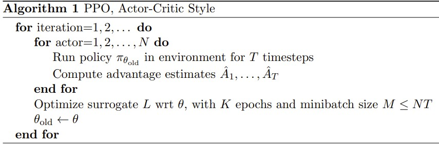
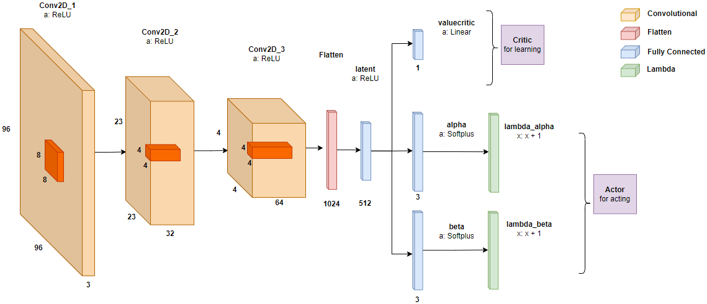

<!-- PROJECT Title -->
<br />
<div align="center">
  <h1 align="center">Proximal Policy Optimization algorithm on a Car Racing environment with wind added</h1>

  <p align="center">
    <b>Bachelor thesis at the Czech Technical University in Prague</b>
  </p>
  <p align="center">
    <i>Author: Vojtěch Sýkora</i>
  </p>
</div>
<!-- ----- -->

<!-- TABLE OF CONTENTS -->
<details>
  <summary>Table of Contents</summary>
  <ol>
    <li>
      <a href="#about-the-project">About The Project</a>
      <ul>
        <li><a href="#environment">Environment</a></li>
        <li><a href="#algorithm">Algorithm</a></li>
        <li><a href="#cnn-network">CNN Network</a></li>
      </ul>
    </li>
    <li>
      <a href="#software-and-hardware-used">Software & Hardware used</a>
      <ul>
        <li><a href="#python-libraries">Python libraries</a></li>
        <li><a href="#rci-cluster">RCI cluster</a></li>
      </ul>
    </li>
   <li>
      <a href="#getting-started">Getting started</a>
      <ul>
        <li><a href="#anaconda-environment">Anaconda environment</a></li>
        <li><a href="#singularity-container">Singularity container</a></li>
      </ul>
    </li>
    <li>
      <a href="#running--training-models">Running & Training Models</a>
      <ul>
        <li><a href="#how-to-run-a-saved-model">How to run a saved model</a></li>
        <li><a href="#how-to-train-a-model">How to train a model</a></li>
      </ul>
    </li>
  </ol>
</details>


<!-- ABOUT THE PROJECT -->
## About the Project

The field of autonomous vehicles has been rapidly growing in recent years, with companies and researchers working on developing vehicles that can navigate complex environments without human intervention. One possible way of achieving such a feat is through the use of reinforcement learning. 
     
To explore this option, OpenAI has developed a 2D car racing environment that can serve as a testbed for autonomous driving algorithms which utilize reinforcement learning techniques. The environment provides researchers with real-life physics and a continuous action space enabling development and testing without the need for physical testing environments and expensive hardware. 

One of the current baselines in Deep Reinforcement Learning is the Proximal Policy Optimization (PPO) algorithm created by OpenAI. It has recently gained popularity thanks to its effectiveness in discrete and continuous action spaces and is being used even in models such as ChatGPT. 

In this thesis, we will modify the car racing environment by introducing wind that can fluctuate in speed and direction. Wind can affect the movement of the car, and hence the driving agent has to take it into consideration. We will investigate how the PPO algorithm effectively adapts to handle the modified environment (with the wind). We will empirically evaluate PPO in the original and modified car racing environments while investigating pre-trained and non-pre-trained agents.

By investigating the impact of an outside and unpredictable factor such as wind on the learning of our agent, this project aims to contribute to the development of more robust and reliable self-driving vehicles.

### Environment

CarRacing-v2 from OpenAI's gym library (for python). The environment was modified using Action wrappers.

https://www.gymlibrary.dev/environments/box2d/car_racing/

<!-- ADD VIDEO of the noWind env and image OF THE ENVIRONMENT HERE -->

### Algorithm
Proximal Policy Optimization algorithm (PPO)
https://arxiv.org/abs/1707.06347


### CNN Network
Our Actor-Critic Deep Convolutional Neural Network was as follows:



Performing well with these hyperparameters:
<div align="center">
    <p>horizon = 2250</p>
    <p>mini-batch size = 1024</p>
    <p>epochs per episode = 3</p>
    <p>gamma = 0.99</p>
    <p>clipping range = 0.15</p>
    <p>gae lambda = 0.9</p>
    <p>value function coefficient = 0.64</p>
    <p>entropy coefficient = 0.0071</p>
    <p>learning rate = 2.5e–4</p>
</div>


<!-- SOFTWARE USED -->
# Software and Hardware used

## Python libraries
(versions can be found in requirements.txt file)
* [pip](https://pypi.org/project/pip/)
* [tensorflow](https://www.tensorflow.org/)
* [tensorflow-probability](https://www.tensorflow.org/probability)
* [numpy](https://numpy.org/)
* [gym](https://www.gymlibrary.dev/)
* [matplotlib](https://matplotlib.org/)
* [seaborn](https://seaborn.pydata.org/)

## RCI Cluster
The access to the computational infrastructure of the OP VVV funded project CZ.02.1.01/0.0/0.0/16\_019/0000765 ``Research Center for Informatics'' is gratefully acknowledged.


<!-- GETTING STARTED -->
# Getting started

First we need to install the python libraries used in this project. This can be done in 2 ways either by creating a Anaconda environment or by creating a Singularity image. Using an anaconda environment is much easier.

## Anaconda Environment
Download Anaconda from https://www.anaconda.com/products/distribution

Navigate to the top folder of the project which has the `tf210.yml` file and execute this command in the terminal.
```sh
conda env create -f tf210.yml
```
Now activate the environment.
```sh
conda activate tf210
```
Now all libraries should be installed, however when rendering the car racing environment there are often many issues specific to you. It works best on a Linux machine. Without the image rendering, no problems should come up.

## Singularity container
Download .sif file of the TensorFlow image
```sh
singularity pull docker://tensorflow/tensorflow:2.10.0-gpu
```

Now run the singularity image.

*If your host system has an NVIDIA GPU card and a driver installed, you can leverage the card with the `--nv` option*

<!-- ```sh
cd /mnt/personal/sykorvo1/PPOthesis/ppo; singularity run --bind /mnt/personal/sykorvo1:/mnt/personal/sykorvo1 --nv tensorflow_2.10.0-gpu.sif
``` -->
```sh
cd <singularity_file_dir>; singularity run --bind <project_dir>:<project_dir> --nv tensorflow_2.10.0-gpu.sif
```

and now you have the terminal to run anything you like.

<!-- RUNNING AND TRAINING MODELS -->
# Running & Training Models

## How to run a saved model
All paths to saved trained model are in the file `ppo/model_paths.py` which has them neatly assigned to variables. You can use these at the bottom of the file `ppo/run_model.py` where you can choose how many models to run on how many environments. 

The default noWind model on a noWind environment is run using
```sh
python run_model.py
```
this will show the scores obtained in the terminal. If you want to render the image, add `-render` at the end of the command. To run for a different number of episodes add `-run=<number>` at the end of the command. If you wanted to change any other parameters, go to `ppo/my_parser.py` for more information (or run `python run_model.py --help`).

To change the wind add `-wind=<wind_name>` to the command. The wind names are `[left, gustyleft, right, gustyright, sides, gustysides]` and if none is specified, there will be no wind acting on the car.

## How to train a model
To train a model run the following
```sh
python train_model.py
```

The training with checkpoints as weight will be saved in the directory `ppo/MODELS` in a subdirectory with the time and date of the beginning of the training. The specific folder is mentioned in the printed information. 

To change the hyperparameters visit `ppo/my_parser.py` for more information.
